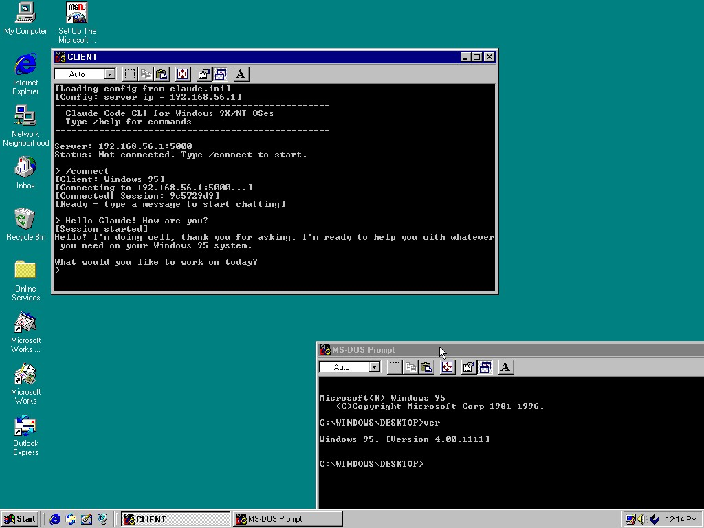

# ClaudeWin9x

Claude Code CLI access on Windows 95/98/2000/XP+ via a bridge server.

[](https://github.com/ryandeering/claude-win9x/actions/workflows/build.yml)
[](https://github.com/ryandeering/claude-win9x/releases/latest)
[](LICENSE)
[](https://ko-fi.com/ryandeering)

**[Download latest release](https://github.com/ryandeering/claude-win9x/releases/latest)** | **[Read the blog post](https://ryandeering.ie/posts/claudewin9x/)**

<br>

> "Your scientists were so preoccupied with whether they could, they didn’t stop to think if they should.”
> - Dr. Ian Malcolm, *Jurassic Park* (1993)

<br>



<video width="800" height="290" src="https://github.com/user-attachments/assets/776ec3cf-317b-4458-a58e-050e199ef1df"></video>

```
┌─────────────────────┐  HTTP   ┌─────────────────────┐  stdio  ┌─────────────────────┐
│   Windows 9x/NT     │  :5000  │       Server        │         │   Claude Code CLI   │
│      Client         │◄───────►│     (.NET 10)       │◄───────►│                     │
│       (C99)         │   TCP   │                     │         │                     │
│                     │◄───────►│  :5001/:5002 files  │         │                     │
└─────────────────────┘         └─────────────────────┘         └─────────────────────┘
```

- Server spawns Claude Code CLI and communicates via JSON over stdio
- Claude Code requests file/command operations via HTTP to the server
- Server queues these operations for the client to poll and execute locally
- All connections initiated by client

## Prerequisites

**Server:** [Claude Code CLI](https://docs.anthropic.com/en/docs/claude-code)

**Client:** Win95 needs Winsock 2 + MSVCRT (get Internet Explorer 5, Winsock 2 update), beyond that shouldn't need any dependency to run the executable but will need TCP/IP networking set up.

## Quick Start

1. **Server:** Run `ClaudeWin9x-Server.exe` (with optional `server.ini`)
2. **Client:** Copy `ClaudeWin9x-Client.exe` and `client.ini` to Win9x/NT, then:
   ```
   C:\> ClaudeWin9x-Client.exe
   > /connect C:\MYPROJECT
   ```

Open ports 5000-5002 between machines.

## Notes

**Security:** All traffic is unencrypted as there is no HTTPS on Win9x (obviously!). Only use on trusted networks.

Command output uses temp files because stdout pipe redirection doesn't work reliably on Windows 9x. As a result, **ClaudeWin9x is less effective than it is on NT-based systems**. It is what it is.

## Configuration

### Client (`client.ini`)
```ini
[server]
ip=192.168.1.100
api_port=5000
download_port=5001
upload_port=5002
skip_permissions=false
```

### Server (`server.ini`)
```ini
[server]
api_port=5000
download_port=5001
upload_port=5002
```

Put these next to their respective executables.

Environment variables (if Claude Code is in non-standard location):
- `CLAUDE_CLI_PATH` - Claude CLI path
- `CLAUDE_NODE_DIR` - Node directory

## Commands

| Command | Description |
|--------|-------------|
| `/connect [path]` | Start session |
| `/disconnect` | End session |
| `/server ip:port` | Set server address |
| `/download <remote> <local>` | Download file |
| `/upload <local> <remote>` | Upload file |
| `/poll` | Check for output |
| `/status` | Connection status |
| `/log [on\|off\|view]` | Logging |
| `/clear` | Clear screen |
| `/help` | Help |
| `/quit` | Exit |

## Build

### Client

```bash
cd client
wmake
```

Builds a standalone executable targeting Win32, 386 and above. Minimum supported OS is Windows 95 OSR 2. Build using [Open Watcom V2](https://github.com/open-watcom/open-watcom-v2/releases/tag/Current-build).

### Server

```bash
cd server/ClaudeWin9x
dotnet run
dotnet publish -r win-x64       # Or linux-x64, osx-arm64, etc
```

Published as a native AOT binary - there's no runtime required (woo!). Requires .NET 10 SDK and Visual Studio Build Tools (Desktop C++ workload) to build on Windows.

## Third Party

- [cJSON](https://github.com/DaveGamble/cJSON) - MIT
- Special thanks to Romane for making the icons in theme with the old Windows style.
